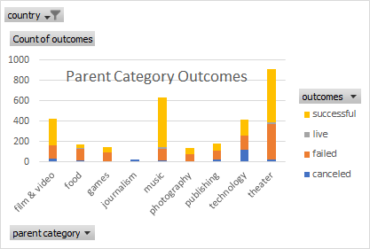
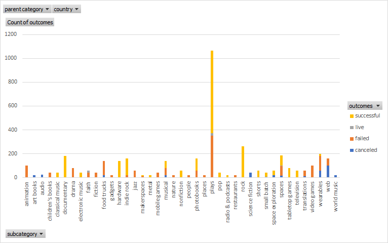
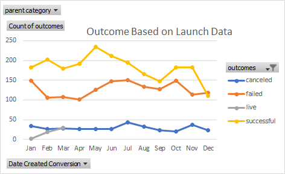
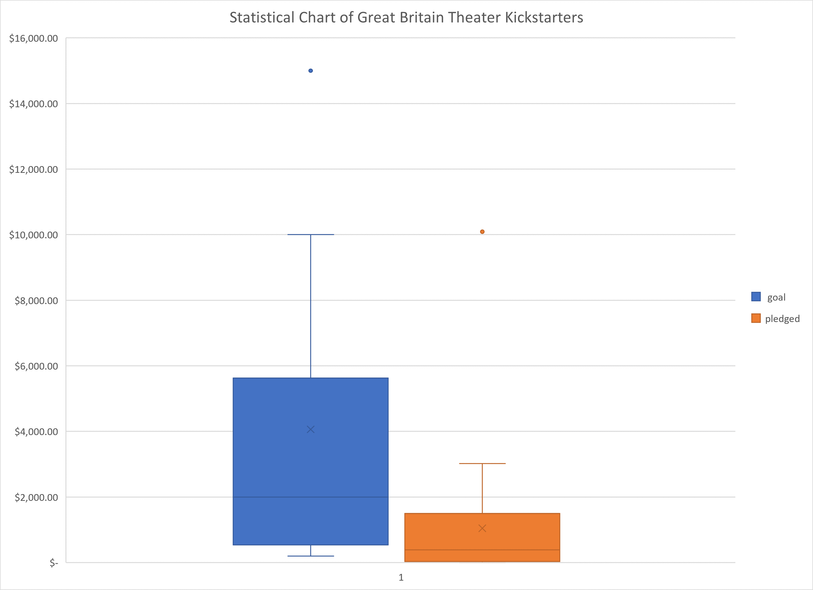

# An Analysis of Kickstarter Campaigns
##Brief description of project: 
Performing analysis on Kickstarter data to uncover trends
---
##Findings:
- Out of all kickstarters, the theater category is by far the most common one with 1393 theater kickstarters out of 4114 total kickstarters. 
- The most common subcategory was plays. Many of them were successful. 
- The most successful launch date for theater kickstarters has been during the months of May and June. 
- For your future project in Great Britain, the plays that you enjoyed from the Edinburgh Festival all surpassed their goals by a small amount. The range of the goals for those specific plays was between 1,000 and 4,000 pounds. Average donations were between $33 and $52. When looking at the statistics for kickstarters in Great Britian in general, half of the successful kickstarters had a goal at or below 2,000 pounds. 
- Looking at descriptive statistics for theater kickstarters in the US a few points emerge: 
  * successful and failed kickstarters have a similar distribution in terms of the amount of money set as a goal and the amount of money pledged.  
  * There were some kickstarters that had lofty goals that drove the mean up very high. Specifically the failed kickstarters median was $5,000 and the mean was  $10,554. Having high goals did not produce better pledges. On the contrary. As a group, the kickstarters with high goals were the ones that failed and their pledge numbers were very low with an IQR of $492. Or in other words the 25% percentile to the 75% percentile of pledges was $492.
---
##Recommendations:
- Theater kickstarters and specifically plays, is a common path and has been proven successful by many previous kickstarters. 
- It is recommended to launch the kickstarter during the months of May or June. 
- Beware of setting goals that are too high. Unless you have specific needs of raising money for a theater building, keeping the goal at a lower number would be best. For the futue project in Great Britain, a goal not exceeding 2,000 pounds would be prudent. 
---

---

---

---

---
