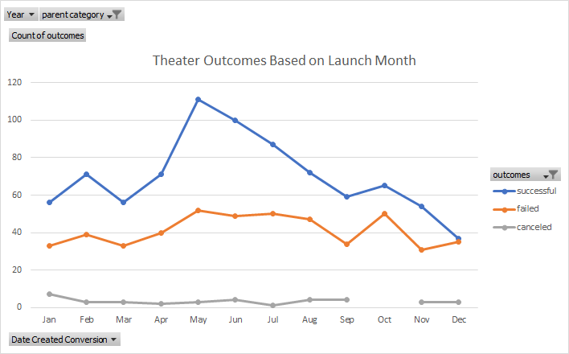
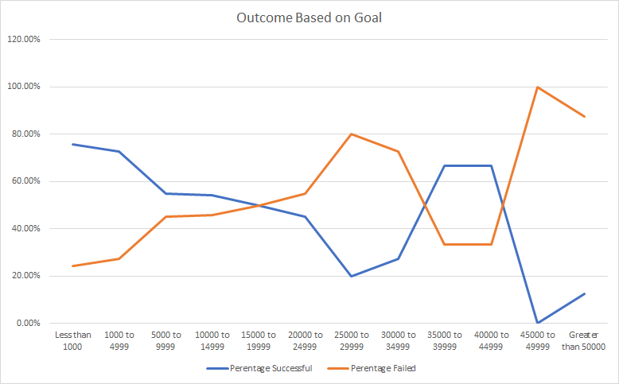

# Kickstarting with Excel

## Overview of project: 
### Purpose:
The purpose of this project is to analyze Kickstarter campaigns to uncover trends. There were two main aspects to the current analysis, the first one was to describe the relationship between timing and outcome of campaigns and the second aim was to understand the relationship between goals and outcomes of campaigns. 
The reason for performing this analysis is to provide Louise with information from past campaigns as the campaign that she launched for the play *Fever* has nearly reached its goal in a short amount of time and she wants to know how other campaigns faired. 
---
## Link to Excel file:

---
## Analysis and Challenges:

### Analysis of Outcomes Based on Launch Date:
The first part of this analysis was to look into potential correlation between the timing of past campaigns and whether those campaigns succeeded, failed or were cancelled. In order to understand the connection between launch month and campaign outcome, a pivot table was created with the outcomes in the columns, the count of outcomes in the values and the date the campaigns were launched in the rows. Two filters were added years and parent category. Theater category was chosen and all years were included in the analysis. In order to view the monthly breakdown of the campaign outcomes, months were grouped in the rows to show the relationship of launch month to campaign outcome. The chart shows on the y axis the count of the outcomes and on the x axis the month they were launched. the different colored lines each represent a different type of outcome. blue for successful, orange for failed and grey for canceled.   

### Analysis of Outcomes Based on Goals
The second part was to relate the goal of the campaign to the outcome. A table was created with the goals divided into subcategories. A breakdown of the number of campaigns that succeeded, failed or were canceled and a percentage of the outcome subcategories were also derived and related to the goal subcategories. A chart was created to demonstrate the relationship between the percentage of successful campaigns, percentage of failed campaigns and how those percentages related to the amoung of money designated as goals for these campaigns. In the chart, the y axis is the percentage of campaigns that have achieved a certain outcome. The x axis is showing the subcategories for goals based on how much money campaigns aimed to raise. The blue line represents the percentage of successful campaigns in each subcategory of goal amount. The orange line represents the percentage of failed campaigns in each subcategory of goal amount. 

### Challenges and Difficulties Encountered:
Challenges were mainly revolving around figuring out how to write functions correctly and how to create the graphs:
- When creating the year column in the Kickstarter sheet for some reason the result of the function that I put in did not match my expectation. I tried to find a solution by reading the instructions provided on Canvas, accessing potential solutions on Google and then I used AskBCS. When I worked with AskBCS the solution was to put the formula in a different column and we didn't quite figure out why it didn't work the first time around. Once I restarted my computer this error was resolved completely. 
- When creating the **Theater Outcomes by Launch Date**, I had to use the reminder of how to group the row labels in order to show the months. I was able to figure it out independently. 
- When creating the **Outcome Based on Goal Chart**, I had to figure out how to include the goal subcategories in the x axis since initially I just chose the two columns of precentages. I figured it out by Googling it and then choosing select data and editing the data in the x axis by highlighting the A column which included all the goal subcategories to include in the x axis. 
- Since this language is new to me all steps are timeconsuming but going slowly through the process with all the support has been very helpful. 
---
## Results and conclusions:
### Results and Conclusions about the Theater Outcomes by Launch Date:
- There seems to be a clear increase in successful outcome of campaigns during the months of May and June. This is seen in the graph below in the high peak of the blue line representing successful outcomes during May and June. The conclusion is that based on this data it is a good idea to launch a campaign during the months of May and June. 
- Overall in the theater category at any month of the year there were more successful campaigns than failed or canceled campaigns. This can be seen in the graph as the blue line is always higher than the orange line. The conclusion is that generally a theater campaign has been successful in the past and therefore may be successful also in the future. 

---
### Results and Conclusions about the Outcomes based on Goals:
- There are two main peaks for successful campaigns the highest peak is for the campaigns with lower goals less than 1000 seems most successful and 1000 to 4999 is second most successful subcategory. Then at a much higher range there is a second peak though the peak is not as high as the first one. This is around 35000 to 44999 dollars. It may be that when campaigns require money for much larger projects for example for building a theater those were successful too. Since Louise is focused on the plays and not on buildings, this seems less relevant for her. Therefore, the most successful campaigns based on goals are the ones in the lowest first two subcategories. Less than 1000 and 1000 to 4999. And this is the range Louise should aim for. 

---
### Summary of the limitations of the dataset:
- It is not clear to me the role of the currency column in the Kickstarter sheet. It is showing different currencies used in different campaigns but then all the goal amounts are presented in dollars. So I'm assuming the local currency amounts were translated into dollars?
- There is no information on the length of each campaign and how it imapcted its success. This is specifically relevant for Louise as she just started a campaign and she may want to know how much longer it might take to raise the money she needs. 
- The data presented in the chart **Theater Outcomes by Launch Date** is showing the breakdown by month but ignoring the year. Using the year filter you can see that the outcomes during May and June were not the best every single year. It may be beneficial to see if there is an explanation behind this. 
#### Other limitations:
- Location of these campaigns is not mentioned. Except for countries. It is quite likely that more specific locations could shed more light on the reasons for certain goal amount being more successful than others. 
- Weather data could potentially impact outcomes as well, that is assuming people are paying for plays that they are going to watch. 
---
### Recommendation for additional tables or graphs:
- I would suggest adding a table and chart that describe the length of time of a campaign and the relationship to its outcome. 
- I would recommend at least glancing through the year by year filtered information to have a more thorough understanding of the Theater Outcome by Launch data chart. 
- The data presented in the two charts above is including all countries. I would recommend looking at this data for the US specifically. For launch data can add country as filter and for the second chart we could add another countif to limit the data to the US. 
- I would focus the additional analysis on the US as this is the primary goal for Lousie but if there were more data on specific locations within the US this would be helpful too. 
---
